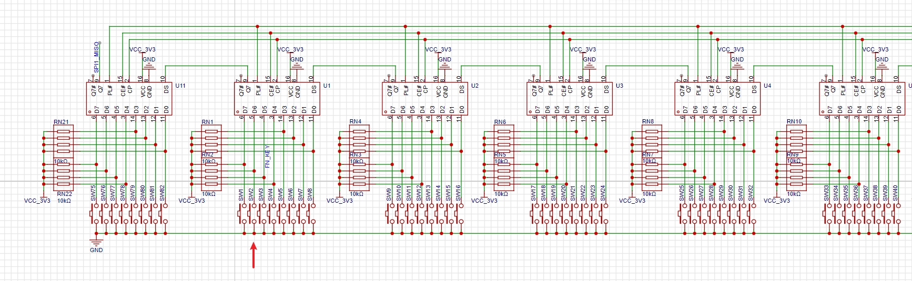
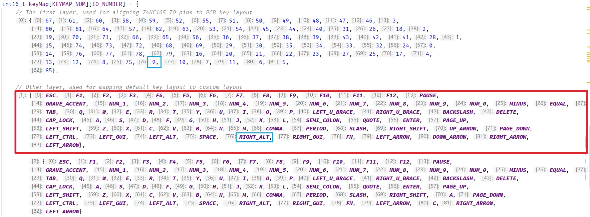
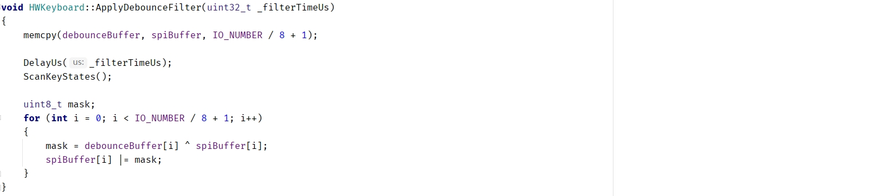

# HelloWord-YueMiPro

# 1. 项目说明

本项目是基于瀚文75机械键盘的二开项目。

对项目进行二开是不是试图复刻是因为我的钱包实在是负担不起外壳的价格，3D打印都要好几百。一套外壳顶小一个月饭钱了。于是选择了悦米机械键盘Pro 静音版来进行改装。毕竟这个键盘有现成的铝坨坨可以用，主要是便宜。

去掉Smart的原因是因为没有扩展模块，并不智能（

**项目目前不完整，在这条文字被加上删除线之前都请暂时不要使用！**

## 2. 硬件架构说明

暂无

## 3. 软件架构说明

**以下引用原文软件架构说明**


**关于键盘固件的按键映射方式？**

为了充分发挥视频中提到的移位寄存器扫描方案的优势，固件代码中将PCB Layout走线和按键扫描顺序解耦，通过软件进行重映射。也就是说PCB中按键的连接可以是任意的，走完线之后可以在`hw_keyboard.h`文件中的`keyMap[KEYMAP_NUM][IO_NUMBER]`中指定映射方式。

> 这是一个二维数组，代表有`KEYMAP_NUM`层键位映射，每一层有`IO_NUMBER`个按键（也就是你的键盘按键数目）；其中第0层是特殊的，负责映射PCB按键的随机布局到键盘标准按键布局，后续的1、2、3、4...层都是自定义的，负责映射标准按键布局到任意布局。

**举个例子：**

考虑原理图中箭头指的那个按键，这个按键可以在PCB的任意位置，但是我们可以看到，它是从左到右（按74HC165的连接顺序，也即移位扫描顺序）的第10颗，因此它的编号为9（从0开始算）.



如果我们在实际的PCB板上把它放在了**右边Alt**的位置，那么参考在下图代码**红色框**中的第1层映射（也就是标准布局）中的`RIGHT_ALT`的序号是76，那么在第0层映射的76号变量就填入9（蓝色框）.

这样依次把你PCB上所有按键都填入0层映射，就得到了一个映射好的标准键盘了。后续2、3、4、5...层需要怎么映射就随意修改添加即可，也不需要再使用数字编号，而是可以直接用枚举的按键名称很方便。

> 所以对于想修改键盘配列的人，只需要再原理图上添加或删减几个串联的74HC165，然后PCB随意走线，再将代码中0层映射删减或增加一些数字即可（比如在下面的例子中我的键盘是83键的）；后面几层的修改就以此类推了。

代码中通过`keyboard.Remap`函数来映射不同层，比如`keyboard.Remap(2)`这一句是使用第2层映射。



**关于键盘固件的滤波方法？**

固件中使用了每个按键独立的滤波，但是是以一种非常高效的方式来实现的（毕竟1KHz的报文，每个报文期间至少扫描两次按键，意味着每秒钟需要进行 **1000\*2\*[按键数目]** 次数的滤波）。

基本原理很简单，就是按键抖动的原因是按下后会在高低电平之间反复横跳，这个稳定时间一般是几十us（注意是电平稳定时间，不是按键触发时间，后者是由于按键簧片接触时间的不确定性导致的，可能长达数ms）。

在QMK的[qmk_firmware/feature_debounce_type](https://github.com/qmk/qmk_firmware/blob/master/docs/feature_debounce_type.md)文档中描述了其使用的几种滤波方法，分为Eager和Defer、对称和非对称等，

默认是使用**对称延迟全局滤波**，也就是说是对所有按键进行同等的滤波，等所有的按键都稳定了不再变化，再提交扫描数据。

> 与之对应的是激进滤波方法，也就是说一旦检测到按键变化就提交数据，但是在这之后的N毫秒时间内不再响应任何按键（也就避免了把不断抖动的按键提交上去）。这种方法触发延迟低，但是对噪声很敏感，容易误触发。

我在瀚文的固件中使用的是**对称延迟独立滤波**，也就是对每个按键进行两次检测，如果第一次检测到了按键变化，那么相隔N微秒（这个参数可以配置，大于按键典型抖动时间即可）再检测一次，如果两次检测结果一致，那么判断按键被按下，此时可以确保按键发生了变化，且不会重复触发按键，兼顾延迟和稳定性。

这个过程是通过异或运算进行高效处理的，正好按键buffer由于是移位寄存器扫描得到的，本身就是每一位代表一个按键，所以滤波效率非常高，实测效果也挺好的。



**关于键盘固件的HID描述符？**

这个可以直接参考源码的`usbd_customhid.c`文件，我配置了两个ReportID，ID-0是上报键位扫描数据的（全键无冲），ID-1是预留用于后续跟上位机改键软件通信用的。

**关于RGB的控制？**

代码中使用的是单总线的ws2812b系列灯珠，一根线就可以串联一大堆RGB，而且代码中实现了SPI-DMA模拟时序，得到了超高的刷新率。

目前代码里只写了一个demo灯效（非常简单就是轮询色彩），自己添加额外的灯效的话，通过`keyboard.SetRgbBuffer`函数设置RGB值，然后`SyncLights`把数据发送给LED即可：

```
while (true)
    {
        /*---- This is a demo RGB effect ----*/
        static uint32_t t = 1;
        static bool fadeDir = true;

        fadeDir ? t++ : t--;
        if (t > 250) fadeDir = false;
        else if (t < 1) fadeDir = true;

        for (uint8_t i = 0; i < HWKeyboard::LED_NUMBER; i++)
            keyboard.SetRgbBuffer(i, HWKeyboard::Color_t{(uint8_t) t, 50, 0});
        /*-----------------------------------*/

        // Send RGB buffers to LEDs
        keyboard.SyncLights();
    }
```
